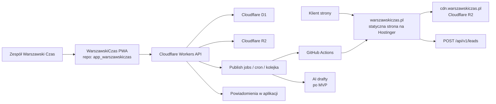
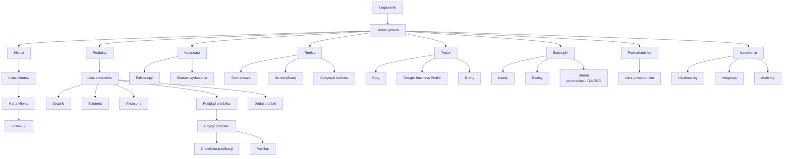
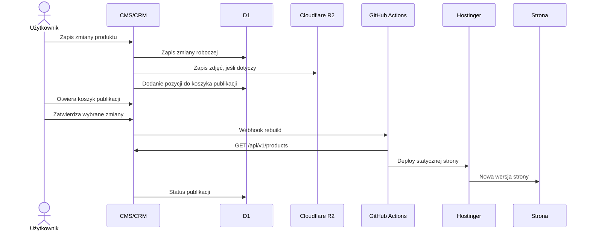
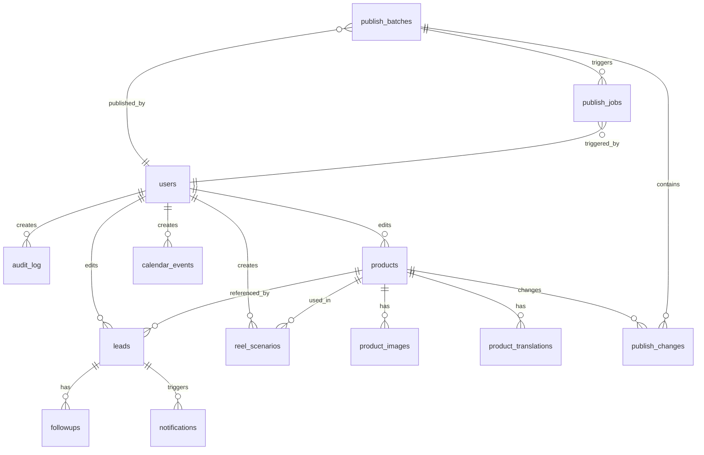

# Plan aplikacji CMS/CRM Warszawski Czas

> Status: dokument decyzyjny  
> Data: 2026-05-18  
> Zakres: wewnętrzna aplikacja webowa/PWA do zarządzania produktami, leadami, follow-upami, reelsami, prostymi treściami i statystykami.  
> Zasada dokumentu: zapisujemy decyzje i schematy, bez opisywania wielu wariantów.

---

## 1. Decyzje główne

- Budujemy własną aplikację CMS/CRM, nie Payload, Directus ani Strapi.
- Aplikacja CMS/CRM będzie w osobnym repozytorium: `app_warszawskiczas`.
- Nazwa aplikacji w UI: `WarszawskiCzas`.
- Aplikacja ma być zbudowana w Next.js, nie w Vite.
- Publiczna strona `warszawskiczas.pl` zostaje statyczna i hostowana na Hostinger Business.
- Zdjęcia produktów będą publiczne i serwowane z Cloudflare R2 przez `cdn.warszawskiczas.pl`.
- CMS/CRM jest źródłem prawdy dla produktów, leadów i procesów operacyjnych.
- Strona publiczna pobiera produkty z CMS-a podczas buildu.
- Publikacja zmian w CMS uruchamia rebuild/deploy strony na Hostinger.
- Publikacja działa przez koszyk zmian: użytkownik zapisuje zmiany, a potem publikuje je osobnym przyciskiem po sprawdzeniu podsumowania.
- Panel wewnętrzny ma działać jako PWA na telefonie.
- MVP ma być minimalistyczne i szybkie w obsłudze na telefonie.
- Aplikacja jest tylko po polsku.
- Dane produktów muszą jednak umożliwiać publikację strony w PL/EN/UA.
- AI nie wchodzi jako pełny moduł MVP, ale architektura ma zostawić na niego miejsce.
- AI nigdy nie publikuje automatycznie; człowiek zatwierdza treści.
- Nie robimy płatności online, koszyka zakupowego ani sklepu internetowego.

---

## 2. Architektura systemu

Adresy:

- `warszawskiczas.pl` - strona publiczna,
- `cdn.warszawskiczas.pl` - zdjęcia produktów,
- adres panelu wewnętrznego jest do decyzji później,
- panel nie musi być subdomeną `warszawskiczas.pl`,
- na start może działać pod technicznym adresem deploymentu, jeśli będzie chroniony logowaniem.

---

## 3. Stack techniczny

Frontend panelu:

- Next.js + React + TypeScript,
- PWA manifest + service worker,
- mobile-first UI,
- proste zakładki zamiast jednego dużego dashboardu,
- Zod do walidacji formularzy,
- wspólny kontrakt typów z API.

Backend:

- Cloudflare Workers,
- Hono albo równoważny lekki router,
- Cloudflare D1 jako baza danych,
- Cloudflare R2 jako storage zdjęć,
- Cloudflare Access jako główna ochrona panelu,
- Cloudflare Turnstile i rate limit dla publicznych endpointów leadów,
- GitHub Actions do przebudowy statycznej strony po publikacji.

Hosting panelu:

- adres panelu wybieramy dopiero przy wdrożeniu,
- nie zapisujemy na sztywno subdomeny `cms.warszawskiczas.pl`,
- nie eksponujemy panelu jako oczywistej subdomeny marki, jeśli nie będzie takiej potrzeby,
- dopuszczamy techniczny adres deploymentu Vercel dla panelu na start, jeśli wybierzemy Vercel,
- jeśli panel będzie poza domeną `warszawskiczas.pl`, nadal musi być chroniony logowaniem i nie może być publicznym, otwartym panelem.

Ważne ograniczenia:

- Nie robimy ciężkiej obróbki zdjęć po stronie Workera.
- Nie przechowujemy filmów reelsów w aplikacji.
- Nie uruchamiamy długich zadań AI w requestach użytkownika.
- Wszystkie większe zadania idą przez jobs/cron/kolejkę.
- Publiczny kontrakt strony musi być wersjonowany jako `/api/v1`.

---

## 4. Logowanie i dostęp

- Dostęp do panelu mają na start 3 osoby.
- Docelowo aplikacja ma obsłużyć maksymalnie około 10 osób.
- Kontrola dostępu idzie przez Cloudflare Access z allowlistą maili.
- W aplikacji istnieją role użytkowników, ale bez ciężkiego systemu uprawnień.
- Użytkownik po zalogowaniu na telefonie powinien mieć długą sesję, żeby nie wpisywać hasła przy każdym użyciu.
- Na dzień 2026-05-18 ustawiamy sesję Cloudflare Access na maksymalny dostępny okres dla aplikacji, czyli 1 miesiąc, jeśli konto Cloudflare nadal udostępnia taki limit.
- Techniczny setup Cloudflare wykonuje administrator/deweloper, nie właściciel butiku.

Proces logowania dla użytkownika:

1. Administrator konfiguruje Cloudflare, domenę, aplikację Access i listę dozwolonych maili.
2. Użytkownik otwiera adres panelu przekazany przez administratora.
3. Użytkownik loguje się przez e-mail i jednorazowy kod.
4. Po pierwszym logowaniu użytkownik dodaje PWA do ekranu telefonu.
5. Administrator ustawia sesję Access na maksymalny dostępny okres, docelowo 1 miesiąc.
6. Przy długiej sesji użytkownik nie powinien wpisywać kodu przy każdym uruchomieniu aplikacji.

Założenie operacyjne:

- właściciel butiku dostaje gotową aplikację,
- administrator/deweloper zarządza konfiguracją Cloudflare i dostępami,
- właściciel nie musi logować się do panelu Cloudflare ani wykonywać zadań technicznych.
- na start nie podpinamy Google/Microsoft, bo jednorazowy kod e-mail jest najprostszym procesem.

Role:

- `user` - może dodawać, edytować i publikować produkty, obsługiwać leady, reelsy, kalendarz i powiadomienia,
- `admin` - ma dodatkowo użytkowników, ustawienia integracji, audit log, limity AI i trwałe usuwanie.

Każdy rekord edytowany przez użytkownika pokazuje w UI:

`Ostatnia edycja: [osoba], [data]`

---

## 5. Mapa widoków aplikacji

Decyzje UX:

- `Kalendarz` pokazuje tylko follow-upy i własne dodane wydarzenia.
- Treści do akceptacji nie są w kalendarzu.
- Scenariusze reelsów do weryfikacji są w module `Reelsy`.
- Scenariusz reelsa może zatwierdzić dowolna osoba z zespołu.
- Drafty bloga i Google Business Profile są w module `Treści`.
- Moduł `Treści` w MVP może istnieć jako pusta/przyszłościowa zakładka.

---

## 6. Design UI

Kierunek wizualny:

- minimalistyczna aplikacja mobilna, nie klasyczny dashboard,
- styl inspirowany prostotą iOS, ale bez kopiowania brandingu Apple,
- czarno-biała baza,
- złoty i ciemnozielony tylko jako akcenty,
- duże, czytelne teksty,
- obsługa jedną ręką,
- gesty i duże obszary dotykowe,
- brak drobnego tekstu jako podstawowego nośnika informacji.

### 6.1. Paleta

Kolory bazowe:

- tło aplikacji: ciepła biel / bardzo jasna szarość,
- powierzchnie kart: biel,
- tekst główny: prawie czarny,
- tekst drugorzędny: neutralna szarość,
- linie i separatory: jasna szarość.

Akcenty:

- złoty: główne akcje, aktywna zakładka, ważne CTA, subtelne wyróżnienia,
- ciemnozielony: status pozytywny, zatwierdzone, opublikowane, wykonane.

Zasada:

- 90% interfejsu to czerń, biel i szarości,
- złoty i zielony są akcentami, nie tłem całej aplikacji,
- nie używamy gradientów, dekoracyjnych plam ani ozdobnych teł.

### 6.2. Typografia i czytelność

- Teksty muszą być wyraźne na telefonie.
- Unikamy bardzo małych etykiet i mikrotekstu.
- Nagłówki ekranów są krótkie: `Dzisiaj`, `Produkty`, `Klient`, `Reelsy`.
- Przyciski mają proste czasowniki: `Dodaj`, `Publikuj`, `Zadzwoń`, `Zapisz`.
- Statusy są krótkie i czytelne: `Do kontaktu`, `W trakcie`, `Follow-up`, `Zakończono`.

Minimalne założenia:

- podstawowy tekst: czytelny bez przybliżania,
- przyciski i pola dotykowe: minimum około 44 px wysokości,
- ważne liczby i statusy większe niż tekst opisowy,
- listy mają dużo oddechu i nie wyglądają jak tabela.

### 6.3. Nawigacja

- Główna nawigacja na telefonie jest na dole.
- Najważniejsze zakładki są dostępne kciukiem.
- Zakładki nie powinny być przeładowane.
- Strona główna pokazuje tylko rzeczy wymagające działania.
- Głębsze akcje idą przez karty, bottom sheety i ekrany szczegółów.

Podstawowy dolny pasek:

- `Start`,
- `Klienci`,
- `Produkty`,
- `Kalendarz`.

Pozostałe moduły mogą być dostępne przez przycisk `Więcej` albo ekran startowy:

- `Reelsy`,
- `Treści`,
- `Statystyki`,
- `Powiadomienia`,
- `Ustawienia`.

### 6.4. Gesty

Interfejs ma wspierać gesty, ale nie może ich wymagać.

Gesty:

- swipe na leadzie: szybkie akcje `Zadzwoń`, `Follow-up`,
- przeciąganie zdjęć produktu do zmiany kolejności,
- bottom sheet dla filtrów i szybkich akcji,
- segmenty/tabs do przełączania statusów,
- pull-to-refresh opcjonalnie w listach,
- sticky CTA na dole ekranu przy najważniejszej akcji.

Każdy gest musi mieć też widoczny przycisk lub alternatywną akcję.

### 6.5. Komponenty bazowe

Komponenty:

- duże karty akcji,
- lista z wyraźnymi wierszami,
- status pill,
- segment control,
- bottom sheet,
- floating add button,
- sticky bottom button,
- chips filtrów,
- checkbox/checklista publikacji,
- pole notatki,
- licznik powiadomień.

Zaokrąglenia:

- karty i kontrolki mogą być lekko zaokrąglone,
- nie używać przesadnie dużych, zabawkowych zaokrągleń,
- karty nie powinny wyglądać jak osobne dekoracyjne kafelki bez funkcji.

### 6.6. Referencje wizualne

Kierunek finalny bazuje na czarno-białym UI z akcentami złota i ciemnej zieleni.

---

## 7. Strona główna aplikacji

Strona główna pokazuje tylko rzeczy wymagające działania:

- nowe leady,
- follow-upy na dziś,
- zaległe follow-upy,
- scenariusze reelsów do weryfikacji,
- produkty zapisane jako ukryte,
- ostatni status publikacji strony,
- najważniejsze powiadomienia.

Skróty na stronie głównej:

- `Dodaj produkt`,
- `Dodaj klienta`,
- `Dodaj wydarzenie`,
- `Dodaj scenariusz reelsa`.

---

## 8. Klienci / leady

Nazwa widoku w aplikacji: `Klienci`.

Leady mają jedną wspólną kolejkę dla całego zespołu. Nie ma przypisywania leadów do osób w MVP.

Statusy leadów:

- `Do kontaktu`,
- `W trakcie`,
- `Follow-up`,
- `Zakończono`.

Opcjonalne powody zamknięcia leada:

- `Sprzedaż`,
- `Brak odpowiedzi`,
- `Nieaktualne`,
- `Spam`,
- `Inne`.

Pola widoczne w formularzu/kartotece klienta:

- numer telefonu, wymagany,
- imię i nazwisko,
- e-mail, opcjonalny przy ręcznym dodawaniu,
- pierwsza wiadomość, opcjonalna,
- notatka.

Reguły:

- lead ze strony może mieć telefon i e-mail wymagane, zgodnie z obecnym formularzem,
- lead dodany ręcznie w aplikacji wymaga numeru telefonu i nazwy klienta,
- nazwa klienta powinna być imieniem i nazwiskiem, jeśli dane są znane,
- jeśli nie znamy imienia i nazwiska, użytkownik musi wpisać inną krótką nazwę rozpoznawczą,
- leady można zamykać,
- leady można usuwać po dodatkowym potwierdzeniu,
- przy zamykaniu leada można opcjonalnie podać powód,
- usunięte leady są miękko usuwane i możliwe do odzyskania przez admina,
- widok usuniętych leadów jest w `Ustawienia -> Zaawansowane`, żeby nie zaśmiecał codziennej pracy.

Pola systemowe:

- status,
- data follow-upu,
- data utworzenia,
- data ostatniej edycji,
- kto ostatnio edytował,
- źródło techniczne, jeśli lead przyszedł ze strony,
- powiązany produkt, jeśli lead przyszedł z karty produktu.

Szybkie follow-upy:

- jutro,
- za 3 dni,
- za 7 dni,
- własna data.

Bez priorytetów w MVP.

---

## 9. Produkty

Produkty w CMS muszą odpowiadać aktualnym polom używanym przez stronę publiczną.

Kategorie:

- `zegarki`,
- `bizuteria`,
- `akcesoria`.

Na start aktywnie obsługujemy zegarki. Biżuteria i akcesoria są przewidziane w strukturze, ale szczegółowe pola biżuterii zostaną dopracowane później.

Zakładki `Biżuteria` i `Akcesoria` są widoczne od razu.

Jeśli w danej kategorii nie ma produktów, aplikacja pokazuje prosty komunikat:

`Na razie brak produktów w tej kategorii`.

Lista produktów w CMS:

- produkty `Ukryte` są domyślnie widoczne w aplikacji,
- ukrycie dotyczy tylko strony publicznej, nie panelu CMS,
- użytkownik może filtrować produkty po widoczności.

### 9.1. Pola produktu

Formularz produktu w CMS ma być oparty na realnym JSON-ie produktów używanym dziś przez stronę, a nie na polach technicznych kontraktu.

Pola uzupełniane przez użytkownika:

- marka,
- nazwa/model,
- referencja,
- materiał/opis konfiguracji,
- rozmiar koperty,
- stan,
- cena,
- cena na zapytanie,
- dostępność,
- widoczność,
- zdjęcia,
- krótki opis,
- tekst editorial,
- historia/opis rozszerzony,
- wyróżnij w katalogu,
- kolekcja specjalna / ekskluzywny, jeśli potrzebne.

Pola generowane automatycznie:

- `id`,
- `slug`,
- `isNew`,
- `publishedAt`,
- `updatedAt`,
- `createdBy`,
- `updatedBy`,
- `publishedBy`.

Pola techniczne trzymane w bazie i API:

- `category`,
- `priceOnRequest`,
- `availability`,
- `visibility`,
- `catalogHighlight`,
- `isExclusive`,
- `deletedAt`,
- `lastPublishedAt`.

Pola niebędące podstawą formularza MVP:

- `year` - zostaje tylko jako pole opcjonalne/zaawansowane, bo aktualny JSON produktów praktycznie go nie używa,
- `featured` - nie używamy tej nazwy; zastępuje ją `catalogHighlight`.

Pola widoczne dziś na karcie produktu strony:

- marka,
- nazwa/model,
- referencja,
- dostępność,
- opis,
- tekst editorial,
- stan,
- materiał,
- rozmiar,
- cena albo cena na zapytanie,
- zdjęcia.

Tłumaczenia na stronę:

- aplikacja CMS jest tylko po polsku,
- przy produkcie wymagane są dane PL,
- CMS musi przechowywać albo generować treści dla strony w PL/EN/UA,
- użytkownik w aplikacji nie musi przełączać języka UI,
- przy dodawaniu zegarka ma być miejsce na wygenerowanie/uzupełnienie wersji językowych dla strony,
- pełniejsza automatyzacja tłumaczeń może być rozbudowana po MVP.

Nie dodajemy w MVP pól typu cena zakupu, marża, źródło pochodzenia ani dane rozliczeniowe.

### 9.2. Widoczność i dostępność

Widoczność:

- `Ukryty`,
- `Publiczny`.

Dostępność:

- `Dostępny`,
- `Na zamówienie`.

Nie używamy statusów:

- `Zarezerwowany`,
- `Niedostępny`.

Reguła ceny:

- `Cena na zapytanie` i `Na zamówienie` to dwa różne stany,
- `Cena na zapytanie` dotyczy produktu dostępnego, którego ceny nie pokazujemy publicznie,
- `Na zamówienie` dotyczy produktu sprowadzanego na zamówienie,
- jeśli produkt ma dostępność `Na zamówienie`, publiczna cena jest czyszczona,
- produkt `Na zamówienie` pokazuje na stronie tekst `Na zamówienie`, nie `Cena na zapytanie`,
- `Na zamówienie` zastępuje obecne znaczenie `Niedostępny`,
- `Dostępny` może mieć cenę publiczną albo `Cena na zapytanie`,
- produkt `Na zamówienie` pozostaje widoczny w katalogu i sitemapie, tak jak obecne produkty `Niedostępny`, ale z nowym tekstem.

Wymagana migracja względem obecnego kodu strony:

- obecny kontrakt `from-cms/schemas/product.ts` ma statusy `Dostępny`, `Zarezerwowany`, `Niedostępny`,
- docelowy CMS ma używać `Dostępny` i `Na zamówienie`,
- przed integracją live trzeba zmienić kontrakt strony i teksty UI.

### 9.3. Filtry produktów

Filtry w CMS mają odpowiadać logice katalogu na stronie:

- kategoria,
- marka,
- dostępność,
- cena,
- tylko cena na zapytanie.

Sortowanie:

- wyróżnione w katalogu,
- cena rosnąco,
- cena malejąco,
- marka A-Z.

Lista produktów w CMS powinna pozwalać na szybką edycję:

- ceny,
- dostępności,
- widoczności,
- wyróżnienia w katalogu,
- kolejności zdjęć.

Wyróżnienie w katalogu:

- pole w UI: `Wyróżnij w katalogu`,
- pole techniczne: `catalogHighlight`,
- ustawiane ręcznie w CMS,
- służy do kontrolowania, które produkty mają być pokazane wyżej albo mocniej zaakcentowane,
- wpływa na kolejność w katalogu,
- pokazuje widoczną etykietę na karcie produktu,
- etykieta na stronie: `Często wybierany`,
- nie nazywamy tego `polecane`, bo to brzmi jak rekomendacja konkretnych modeli zegarków.

Nowość:

- `isNew` ustawiane automatycznie przez 7 dni od publikacji,
- po 7 dniach produkt przestaje być oznaczony jako nowość bez ręcznej pracy użytkownika.

Ukrywanie i usuwanie:

- produkt można ukryć, wtedy nie jest widoczny na stronie, ale zostaje widoczny w aplikacji,
- produkt można usunąć po dodatkowym potwierdzeniu,
- potwierdzenie usunięcia to zwykłe kliknięcie w modalu, bez wpisywania słowa `USUŃ`,
- usunięcie produktu jest miękkie przez `deleted_at`,
- usunięty produkt może odzyskać admin,
- widok usuniętych produktów jest w `Ustawienia -> Zaawansowane`, żeby nie przeszkadzał w codziennej pracy,
- usunięcie zapisuje wpis w audit logu.

### 9.4. Checklista publikacji produktu

Przed publikacją produkt powinien mieć checklistę:

- zdjęcia dodane,
- marka uzupełniona,
- nazwa uzupełniona,
- referencja uzupełniona,
- cena albo cena na zapytanie albo `Na zamówienie`,
- dostępność ustawiona,
- opis uzupełniony,
- slug wygenerowany,
- podgląd strony sprawdzony.

Każdy użytkownik może publikować.

---

## 10. Zdjęcia produktów

- Zdjęcia mogą być publiczne.
- Zdjęcia produktów są przechowywane w Cloudflare R2.
- Strona używa URL-i z `cdn.warszawskiczas.pl`.
- W MVP wystarczy upload zdjęć do R2 i ustawienie kolejności.
- Oryginały zdjęć nie muszą być przechowywane w aplikacji w MVP.
- Aplikacja powinna pozwalać ustawić kolejność zdjęć.
- Kompresja, usuwanie EXIF i lepsze warianty obrazów są zaplanowane jako rozbudowa po MVP.

Docelowe rozmiary zdjęć po rozbudowie:

- `thumb`,
- `medium`,
- `large`.

---

## 11. Publikacja strony i koszyk zmian

Wymagania:

- zapis produktu nie publikuje strony,
- zapis zmiany dodaje ją do koszyka publikacji,
- koszyk publikacji działa podobnie do koszyka w ecommerce,
- koszyk pokazuje podsumowanie zmian przed publikacją,
- z koszyka można usunąć pojedynczą zmianę i kontynuować pracę,
- ukrycie produktu jest zmianą w koszyku i wymaga publikacji,
- zmiana ceny, dostępności, opisu, zdjęć lub widoczności jest zmianą w koszyku,
- publikacja koszyka uruchamia rebuild strony,
- CMS pokazuje status ostatniej publikacji,
- CMS pozwala ponowić nieudaną publikację,
- rebuildy muszą mieć debounce, żeby seria edycji nie odpaliła wielu deployów.

---

## 12. Kalendarz

Kalendarz pokazuje:

- follow-upy klientów,
- własne dodane wydarzenia.

Kalendarz nie pokazuje:

- draftów bloga,
- treści do akceptacji,
- scenariuszy reelsów do weryfikacji.

Własne wydarzenie ma pola:

- tytuł,
- data i godzina albo tryb całodniowy,
- notatka opcjonalna,
- utworzone przez,
- data utworzenia.

---

## 13. Reelsy

Moduł reelsów służy do prostego planowania scenariuszy i statusów nagrań. Nie służy do przechowywania filmów.

Pola scenariusza:

- tekst scenariusza,
- powiązany zegarek/produkt, opcjonalny,
- status,
- notatka opcjonalna,
- utworzone przez,
- ostatnia edycja.

Statusy reelsów:

- `Do weryfikacji`,
- `Do nagrania`,
- `Nagrane`,
- `Opublikowane`.

Zatwierdzanie:

- status `Do weryfikacji` może zmienić dowolna osoba z zespołu,
- w audit logu zapisujemy kto zatwierdził albo zmienił status.

Nie używamy statusów:

- `Pomysł`,
- `Archiwum`.

Statystyki reelsów:

- scenariusze do weryfikacji,
- scenariusze do nagrania,
- nagrane,
- opublikowane.

---

## 14. Treści

Moduł `Treści` jest widoczny w MVP jako zakładka przygotowana pod dalszą rozbudowę.

W MVP moduł pokazuje prosty komunikat:

`Pracujemy nad tym modułem`.

Docelowe sekcje:

- blog,
- Google Business Profile,
- drafty,
- historia publikacji.

W MVP nie budujemy pełnego edytora bloga i nie budujemy automatycznej publikacji GBP.

---

## 15. AI po MVP

AI nie jest pełnym modułem MVP.

Architektura ma jednak zostawić miejsce na:

- drafty opisów produktów,
- drafty blogów,
- drafty Google Business Profile,
- research newsów zegarkowych,
- sugestie scenariuszy reelsów,
- sugestie SEO.

Zasady AI:

- AI tworzy draft,
- użytkownik zatwierdza,
- AI nie publikuje samodzielnie,
- prywatne dane leadów nie są wysyłane do darmowych modeli AI,
- każdy research AI zapisuje źródła.

Minimalne tabele przygotowujące pod AI po MVP:

- `content_drafts`,
- `content_sources`,
- `automation_jobs`,
- `ai_usage_log`.

---

## 16. Powiadomienia

MVP:

- powiadomienia w aplikacji,
- licznik nieprzeczytanych,
- ekran `Powiadomienia`,
- powiadomienie na telefon dla osób z zainstalowaną aplikacją, jeśli web push działa poprawnie na ich urządzeniu.

Powiadomienia dotyczą:

- nowego leada,
- follow-upu na dziś,
- zaległego follow-upu,
- nieudanej publikacji strony,
- scenariusza reelsa do weryfikacji.

Push na telefon:

- nowy lead powinien dawać powiadomienie push i licznik w aplikacji,
- follow-up powinien dawać powiadomienie push i licznik w aplikacji,
- powiadomienia push są częścią MVP,
- push nie może być jedynym miejscem informacji o ważnym zadaniu.

---

## 17. Statystyki

Statystyki MVP mają być krótkie i operacyjne.

Leady:

- liczba nowych leadów,
- liczba leadów w kontakcie,
- liczba leadów nieoddzwonionych,
- liczba zaległych follow-upów,
- liczba zakończonych leadów.

Reelsy:

- scenariusze do weryfikacji,
- scenariusze do nagrania,
- nagrane,
- opublikowane.

Produkty:

- produkty publiczne,
- produkty ukryte,
- produkty na zamówienie,
- produkty bez zdjęć albo bez opisu.

Strona:

- sekcja statystyk strony ma pokazywać placeholder `Połącz GA/GSC`,
- docelowo kliknięcia, konwersje, formularze, kliknięcia telefonu, top strony i top produkty.

Statystyki operacyjne leadów, produktów i reelsów działają w MVP bez GA/GSC.

Nie budujemy rozbudowanego systemu analitycznego w MVP.

---

## 18. Model danych MVP

### `users`

- `id`,
- `email`,
- `name`,
- `role`,
- `active`,
- `created_at`.

### `products`

- `id`,
- `slug`,
- `category`,
- `brand`,
- `name`,
- `reference`,
- `year`, opcjonalne/zaawansowane,
- `condition`,
- `material`,
- `case_size`,
- `price`,
- `price_on_request`,
- `availability`,
- `visibility`,
- `description`,
- `editorial`,
- `story`,
- `is_new`,
- `is_exclusive`,
- `catalog_highlight`,
- `published_at`,
- `updated_at`,
- `deleted_at`,
- `created_by`,
- `updated_by`,
- `published_by`.

### `product_images`

- `id`,
- `product_id`,
- `url_thumb`,
- `url_medium`,
- `url_large`,
- `alt`,
- `sort_order`,
- `created_at`.

### `product_translations`

- `id`,
- `product_id`,
- `locale`,
- `name`,
- `description`,
- `editorial`,
- `story`,
- `material`,
- `condition`,
- `created_at`,
- `updated_at`.

### `leads`

- `id`,
- `phone`,
- `full_name`,
- `email`,
- `first_message`,
- `note`,
- `status`,
- `followup_at`,
- `close_reason`,
- `source`,
- `product_id`,
- `closed_at`,
- `deleted_at`,
- `created_at`,
- `updated_at`,
- `updated_by`.

### `publish_batches`

- `id`,
- `status`,
- `summary`,
- `published_by`,
- `published_at`,
- `created_at`.

### `publish_changes`

- `id`,
- `batch_id`,
- `entity_type`,
- `entity_id`,
- `change_type`,
- `summary`,
- `status`,
- `created_by`,
- `created_at`.

### `followups`

- `id`,
- `lead_id`,
- `due_at`,
- `done_at`,
- `created_by`,
- `created_at`.

### `calendar_events`

- `id`,
- `title`,
- `starts_at`,
- `all_day`,
- `note`,
- `created_by`,
- `created_at`.

### `reel_scenarios`

- `id`,
- `scenario_text`,
- `product_id`, opcjonalne,
- `status`,
- `note`,
- `reviewed_by`,
- `reviewed_at`,
- `created_by`,
- `updated_by`,
- `created_at`,
- `updated_at`.

### `notifications`

- `id`,
- `user_id`,
- `type`,
- `title`,
- `body`,
- `read_at`,
- `created_at`.

### `publish_jobs`

- `id`,
- `status`,
- `triggered_by`,
- `started_at`,
- `finished_at`,
- `error_message`.

### `audit_log`

- `id`,
- `actor_user_id`,
- `entity_type`,
- `entity_id`,
- `action`,
- `summary`,
- `created_at`.

### `settings`

- `key`,
- `value`,
- `updated_at`,
- `updated_by`.

---

## 19. Kontrakty API

Publiczne API dla strony:

- `GET /api/v1/products`,
- `POST /api/v1/leads`,
- `GET /api/v1/translations?locale=...` opcjonalnie.

Wewnętrzne API dla aplikacji:

- `GET /internal/products`,
- `POST /internal/products`,
- `PATCH /internal/products/:id`,
- `GET /internal/publish-cart`,
- `POST /internal/publish-cart/changes`,
- `DELETE /internal/publish-cart/changes/:id`,
- `POST /internal/publish-cart/publish`,
- `GET /internal/leads`,
- `POST /internal/leads`,
- `PATCH /internal/leads/:id`,
- `POST /internal/followups`,
- `PATCH /internal/followups/:id`,
- `GET /internal/calendar`,
- `POST /internal/calendar-events`,
- `GET /internal/reels`,
- `POST /internal/reels`,
- `PATCH /internal/reels/:id`,
- `GET /internal/notifications`,
- `PATCH /internal/notifications/:id/read`,
- `GET /internal/stats`,
- `GET /internal/audit-log`.

Zasady API:

- publiczne API strony jest stabilne i wersjonowane,
- endpoint leadów ma rate limit i ochronę antyspamową,
- wewnętrzne endpointy wymagają zalogowanego użytkownika,
- każda mutacja zapisuje audit log.

---

## 20. Zakres MVP

MVP obejmuje:

- osobne repo aplikacji CMS/CRM: `app_warszawskiczas`,
- logowanie i dostęp dla 3 osób,
- PWA na telefon,
- zakładki aplikacji,
- produkty z uploadem zdjęć do R2,
- koszyk publikacji zmian i rebuild strony po zatwierdzeniu,
- klientów/leady,
- follow-upy,
- kalendarz follow-upów i własnych wydarzeń,
- proste reelsy,
- powiadomienia w aplikacji i push na telefon,
- krótkie statystyki operacyjne,
- widoczny moduł `Treści` z komunikatem `Pracujemy nad tym modułem`,
- placeholder `Połącz GA/GSC` w statystykach strony.

MVP nie obejmuje:

- płatności online,
- koszyka zakupowego,
- pełnego inboxa WhatsApp,
- przechowywania filmów reelsów,
- pełnego edytora bloga,
- automatycznej publikacji AI,
- rozbudowanego BI/analityki,
- pól finansowych produktu,
- osobnych zaawansowanych pól biżuterii.

---

## 21. Kolejność prac

1. Założyć osobne repo `app_warszawskiczas`.
   - docelowa lokalizacja: `C:\Users\212ka\source\repos\app_warszawskiczas`
2. Przygotować fundament PWA i routing zakładek.
3. Podłączyć Cloudflare Access.
4. Zaprojektować D1 schema zgodnie z tym dokumentem.
5. Zbudować produkty i upload zdjęć do R2.
6. Zbudować publiczne `GET /api/v1/products`.
7. Zbudować koszyk publikacji zmian.
8. Podłączyć rebuild strony po zatwierdzeniu koszyka publikacji.
9. Zbudować leady i `POST /api/v1/leads`.
10. Zbudować follow-upy i kalendarz.
11. Zbudować prosty moduł reelsów.
12. Dodać powiadomienia w aplikacji i push.
13. Dodać statystyki operacyjne.
14. Zostawić widoczny moduł `Treści` z komunikatem o pracy nad modułem.
15. Dopiero po stabilnym MVP wrócić do AI, bloga, GBP i integracji.

---

## 22. Reguły jakości

- UI ma być minimalistyczny i szybki na telefonie.
- Każdy widok ma robić jedną rzecz dobrze.
- Formularze mają mieć mało pól.
- Statusy mają być krótkie i zrozumiałe.
- Dane publicznej strony mają pochodzić tylko z CMS-a.
- Kod strony publicznej nie może znać wewnętrznych szczegółów CMS-a.
- Zmiana kontraktu publicznego wymaga wersji API.
- Każda publikacja i edycja ma być widoczna w audit logu.
- Jeśli funkcja nie oszczędza czasu w codziennej pracy, nie wchodzi do MVP.
