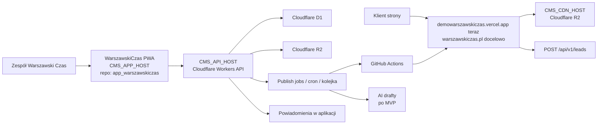
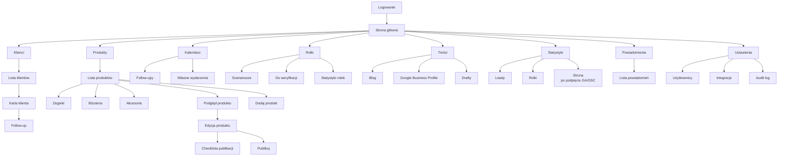
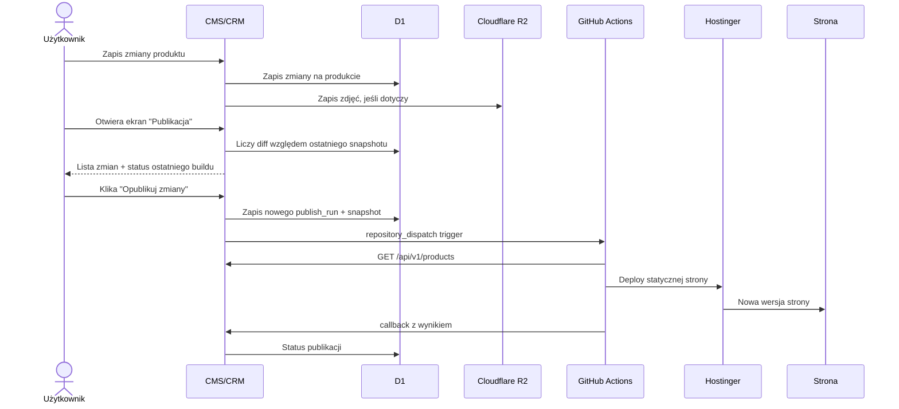
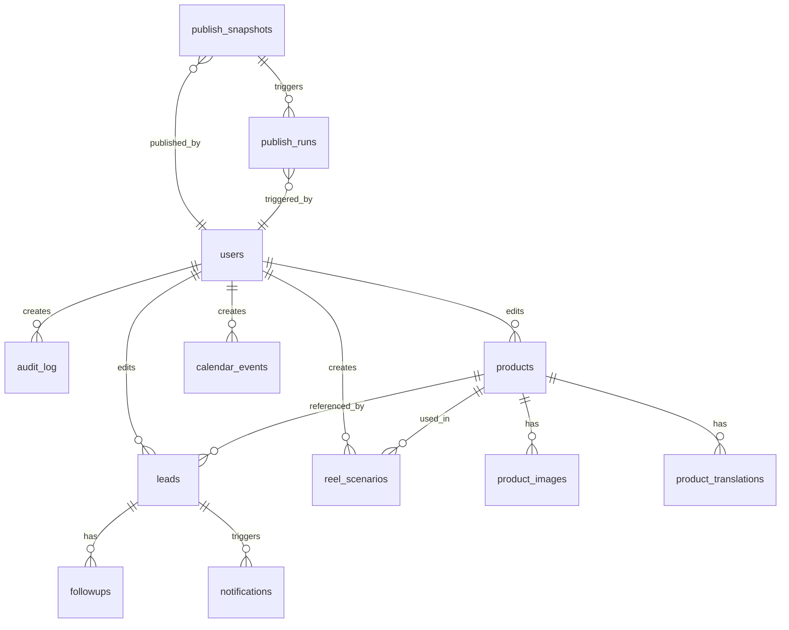

# Plan aplikacji CMS/CRM Warszawski Czas

> Status: dokument decyzyjny  
> Data: 2026-05-18  
> Zakres: wewnętrzna aplikacja webowa/PWA do zarządzania produktami, leadami, follow-upami, rolkami, prostymi treściami i statystykami.
> Środowisko, hosty i lokalizacja danych: [CMS-CRM-ENVIRONMENT.md](CMS-CRM-ENVIRONMENT.md).
> Zasada dokumentu: zapisujemy decyzje i schematy, bez opisywania wielu wariantów.

---

## 1. Decyzje główne

- Budujemy własną aplikację CMS/CRM, nie Payload, Directus ani Strapi.
- Aplikacja CMS/CRM będzie w osobnym repozytorium: `app_warszawskiczas`.
- Nazwa aplikacji w UI: `WarszawskiCzas`.
- Aplikacja ma być zbudowana w Next.js, nie w Vite.
- Publiczna strona docelowo zostaje statyczna i hostowana na Hostinger Business; stan przejściowy: demo działa na `https://demowarszawskiczas.vercel.app`.
- Zdjęcia produktów będą publiczne i serwowane z Cloudflare R2 przez host `CMS_CDN_HOST` z dokumentu środowiska.
- Hosty aplikacji, API i CDN nie są wpisywane na sztywno w planie; źródłem prawdy jest `CMS-CRM-ENVIRONMENT.md`.
- CMS/CRM jest źródłem prawdy dla produktów, leadów i procesów operacyjnych.
- Strona publiczna pobiera produkty z CMS-a podczas buildu.
- Publikacja z punktu kontrolnego w CMS docelowo uruchamia rebuild/deploy strony na Hostinger; w okresie przejściowym najpierw walidujemy formularze na Vercel demo.
- Publikacja działa przez punkt kontrolny: zmiany trafiają od razu do bazy CMS, a osobny ekran pokazuje diff względem ostatniego opublikowanego stanu i pozwala uruchomić build jednym przyciskiem po sprawdzeniu podsumowania.
- Panel wewnętrzny ma działać jako PWA na telefonie.
- MVP ma być minimalistyczne i szybkie w obsłudze na telefonie.
- Aplikacja jest tylko po polsku.
- Dane produktów muszą jednak umożliwiać publikację strony w PL/EN/UA.
- AI nie wchodzi jako pełny moduł MVP, ale architektura ma zostawić na niego miejsce.
- AI nigdy nie publikuje automatycznie; człowiek zatwierdza treści.
- Nie robimy płatności online, koszyka zakupowego ani sklepu internetowego.

---

## 2. Architektura systemu



Adresy:

- `https://demowarszawskiczas.vercel.app` - tymczasowy frontend demo,
- `warszawskiczas.pl` - docelowa strona publiczna,
- adresy panelu, API i CDN są w [CMS-CRM-ENVIRONMENT.md](CMS-CRM-ENVIRONMENT.md),
- tymczasowo panel działa pod `CMS_APP_HOST`, API pod `CMS_API_HOST`, a zdjęcia pod `CMS_CDN_HOST`,
- panel nie musi być subdomeną `warszawskiczas.pl`; na start używamy hostów z dokumentu środowiska,
- zmiana domeny ma wymagać podmiany jednego dokumentu środowiska i konfiguracji Cloudflare, nie edycji planu.

---

## 3. Stack techniczny

Frontend panelu:

- Next.js + React + TypeScript,
- deployment Next.js do Cloudflare Workers przez `@opennextjs/cloudflare`,
- PWA manifest + service worker,
- mobile-first UI,
- proste zakładki zamiast jednego dużego dashboardu,
- Zod do walidacji formularzy,
- wspólny kontrakt typów z API.

Backend:

- Cloudflare Workers,
- Hono albo równoważny lekki router,
- Cloudflare D1 jako baza danych,
- Cloudflare R2 jako storage zdjęć,
- Cloudflare Access jako główna ochrona panelu,
- Cloudflare Turnstile i rate limit dla publicznych endpointów leadów,
- GitHub Actions do przebudowy statycznej strony po publikacji.

Hosting panelu:

- hosty panelu, API i CDN są trzymane w `CMS-CRM-ENVIRONMENT.md`,
- tymczasowo używamy wartości hostów z dokumentu środowiska,
- nie zapisujemy domen w kodzie ani dokumentach slice'ów poza źródłem prawdy,
- panel poza domeną `warszawskiczas.pl` nadal musi być chroniony Cloudflare Access i nie może być publicznym, otwartym panelem.

Ważne ograniczenia:

- Nie robimy ciężkiej obróbki zdjęć po stronie Workera.
- Nie przechowujemy filmów rolek w aplikacji.
- Nie uruchamiamy długich zadań AI w requestach użytkownika.
- Wszystkie większe zadania idą przez jobs/cron/kolejkę.
- Publiczny kontrakt strony musi być wersjonowany jako `/api/v1`.

### 3.1. Runtime produkcyjny - V8 isolates, nie Node.js

Aplikacja jest pisana w TypeScripcie i Next.js, ale uruchamia się w V8 isolates (Cloudflare Workers runtime), nie w Node.js. Front Next.js wdrażamy przez `@opennextjs/cloudflare`, a API działa w tym samym runtime Workers. Hono może obsługiwać wewnętrzne i publiczne endpointy API, jeśli przy implementacji da najprostszy routing.

Co działa bez zmian:

- TypeScript, ESM, async/await, fetch, Request/Response, crypto.subtle,
- Hono, Zod, date-fns, nanoid, Drizzle ORM dla D1,
- React 19, Next.js 15.

Co nie działa lub wymaga obejścia:

- `fs` / `fs/promises` - brak filesystem (zamiast tego R2/D1/KV),
- `child_process`, `cluster` - brak procesów,
- `net` (TCP sockets) - tylko HTTP fetch (z ograniczonym `connect()`),
- pakiety natywne C++ (`sharp`, `bcrypt`, `node-canvas`) - dla obrazów używamy Cloudflare Images,
- `Buffer` - przez polyfill, natywnie używamy `Uint8Array`,
- pełen `node:crypto` - większość działa, niektóre legacy API wymagają polyfilla.

Mitigation: w `wrangler.toml` flaga `nodejs_compat = true` daje polyfille najczęściej używanych Node API. Większość npm packages "wymagających Node" działa po jej włączeniu.

Skrypty jednorazowe vs. produkcja:

- skrypty migracji (`scripts/import-products.ts`, `scripts/upload-images.ts`) uruchamiamy lokalnie w Node przez `npx tsx` - mogą używać `fs`, `sharp` itd.,
- kod produkcyjny aplikacji CMS nigdy nie biegnie w Node - tylko w Cloudflare Workers runtime,
- `wrangler dev` lokalnie emuluje Workers runtime, nie pełen Node.

Spójność ze stroną - faktyczna sytuacja:

- pozorna spójność "obie aplikacje w Node" jest mityczna, bo strona warszawskiczas.pl jest statycznie eksportowana (`output: 'export'`) i na produkcji u Hostingera serwuje ją Apache jako pliki HTML/CSS/JS,
- żaden Node nie biegnie na produkcji strony,
- Node jest używany tylko do buildu (Next.js, GitHub Actions) - tak samo jak w aplikacji CMS,
- faktyczna spójność, która istnieje i ma znaczenie: TypeScript w obu projektach, Next.js w obu projektach, Zod jako kontrakt w obu projektach, React 19 w obu projektach, te same narzędzia developerskie,
- co się różni: cel deploymentu (Apache static vs V8 isolates), ale source code w 95% identyczny.

Dlaczego nie pełny Node host (Vercel, Fly.io, VPS):

- brak porównywalnego free tier (Vercel free wyklucza projekty komercyjne regulaminowo, Fly.io kasuje przy małej skali, VPS to dodatkowy ops),
- Cloudflare Access wymaga CF DNS i CF proxy - na Node hoście trzeba budować własny auth (NextAuth + 2FA),
- D1 i R2 są natywnie dostępne tylko z Workers (z Node przez HTTP API z osobnym tokenem zarządzania),
- dodatkowy provider = dodatkowy bill, dashboard, punkt awarii,
- brak realnej korzyści, bo source code jest identyczny TypeScript.

Decyzja: V8 isolates (Cloudflare Workers przez `@opennextjs/cloudflare`) dla aplikacji CMS. Strona nadal statycznie na Hostinger.

---

## 4. Logowanie i dostęp

- Dostęp do panelu mają na start 3 osoby.
- Docelowo aplikacja ma obsłużyć maksymalnie około 10 osób.
- Kontrola dostępu idzie przez Cloudflare Access z allowlistą maili.
- W aplikacji istnieją role użytkowników, ale bez ciężkiego systemu uprawnień.
- Użytkownik po zalogowaniu na telefonie powinien mieć długą sesję, żeby nie wpisywać hasła przy każdym użyciu.
- Na dzień 2026-05-18 ustawiamy sesję Cloudflare Access na maksymalny dostępny okres dla aplikacji, czyli 1 miesiąc, jeśli konto Cloudflare nadal udostępnia taki limit.
- Techniczny setup Cloudflare wykonuje administrator/deweloper, nie właściciel butiku.

Proces logowania dla użytkownika:

1. Administrator konfiguruje Cloudflare, domenę, aplikację Access i listę dozwolonych maili.
2. Użytkownik otwiera adres panelu przekazany przez administratora.
3. Użytkownik loguje się przez e-mail i jednorazowy kod.
4. Po pierwszym logowaniu użytkownik dodaje PWA do ekranu telefonu.
5. Administrator ustawia sesję Access na maksymalny dostępny okres, docelowo 1 miesiąc.
6. Przy długiej sesji użytkownik nie powinien wpisywać kodu przy każdym uruchomieniu aplikacji.

Założenie operacyjne:

- właściciel butiku dostaje gotową aplikację,
- administrator/deweloper zarządza konfiguracją Cloudflare i dostępami,
- właściciel nie musi logować się do panelu Cloudflare ani wykonywać zadań technicznych.
- na start nie podpinamy Google/Microsoft, bo jednorazowy kod e-mail jest najprostszym procesem.

Role:

- `user` - może dodawać, edytować i publikować produkty, obsługiwać leady, rolki, kalendarz i powiadomienia,
- `admin` - ma dodatkowo użytkowników, ustawienia integracji, audit log, limity AI i trwałe usuwanie.

Każdy rekord edytowany przez użytkownika pokazuje w UI:

`Ostatnia edycja: [osoba], [data]`

---

## 5. Mapa widoków aplikacji



Decyzje UX:

- `Kalendarz` pokazuje tylko follow-upy i własne dodane wydarzenia.
- Treści do akceptacji nie są w kalendarzu.
- Scenariusze rolek do weryfikacji są w module `Rolki`.
- Scenariusz rolki może zatwierdzić dowolna osoba z zespołu.
- Drafty bloga i Google Business Profile są w module `Treści`.
- Moduł `Treści` w MVP może istnieć jako pusta/przyszłościowa zakładka.

---

## 6. Design UI

Kierunek wizualny:

- minimalistyczna aplikacja mobilna, nie klasyczny dashboard,
- styl inspirowany prostotą iOS, ale bez kopiowania brandingu Apple,
- czarno-biała baza,
- złoty i ciemnozielony tylko jako akcenty,
- duże, czytelne teksty,
- obsługa jedną ręką,
- gesty i duże obszary dotykowe,
- brak drobnego tekstu jako podstawowego nośnika informacji.

### 6.1. Paleta

Kolory bazowe:

- tło aplikacji: ciepła biel / bardzo jasna szarość,
- powierzchnie kart: biel,
- tekst główny: prawie czarny,
- tekst drugorzędny: neutralna szarość,
- linie i separatory: jasna szarość.

Akcenty:

- złoty: główne akcje, aktywna zakładka, ważne CTA, subtelne wyróżnienia,
- ciemnozielony: status pozytywny, zatwierdzone, opublikowane, wykonane.

Zasada:

- 90% interfejsu to czerń, biel i szarości,
- złoty i zielony są akcentami, nie tłem całej aplikacji,
- nie używamy gradientów, dekoracyjnych plam ani ozdobnych teł.

### 6.2. Typografia i czytelność

- Teksty muszą być wyraźne na telefonie.
- Unikamy bardzo małych etykiet i mikrotekstu.
- Nagłówki ekranów są krótkie: `Dzisiaj`, `Produkty`, `Klient`, `Rolki`.
- Przyciski mają proste czasowniki: `Dodaj`, `Publikuj`, `Zadzwoń`, `Zapisz`.
- Statusy są krótkie i czytelne: `Do kontaktu`, `W trakcie`, `Follow-up`, `Zakończono`.

Minimalne założenia:

- podstawowy tekst: czytelny bez przybliżania,
- przyciski i pola dotykowe: minimum około 44 px wysokości,
- ważne liczby i statusy większe niż tekst opisowy,
- listy mają dużo oddechu i nie wyglądają jak tabela.

### 6.3. Nawigacja

- Główna nawigacja na telefonie jest na dole.
- Najważniejsze zakładki są dostępne kciukiem.
- Zakładki nie powinny być przeładowane.
- Strona główna pokazuje tylko rzeczy wymagające działania.
- Głębsze akcje idą przez karty, bottom sheety i ekrany szczegółów.

Podstawowy dolny pasek:

- `Start`,
- `Klienci`,
- `Produkty`,
- `Kalendarz`.

Pozostałe moduły mogą być dostępne przez przycisk `Więcej` albo ekran startowy:

- `Rolki`,
- `Treści`,
- `Statystyki`,
- `Powiadomienia`,
- `Ustawienia`.

### 6.4. Gesty

Interfejs ma wspierać gesty, ale nie może ich wymagać.

Gesty:

- swipe na leadzie: szybkie akcje `Zadzwoń`, `Follow-up`,
- przeciąganie zdjęć produktu do zmiany kolejności,
- bottom sheet dla filtrów i szybkich akcji,
- segmenty/tabs do przełączania statusów,
- pull-to-refresh opcjonalnie w listach,
- sticky CTA na dole ekranu przy najważniejszej akcji.

Każdy gest musi mieć też widoczny przycisk lub alternatywną akcję.

### 6.5. Komponenty bazowe

Komponenty:

- duże karty akcji,
- lista z wyraźnymi wierszami,
- status pill,
- segment control,
- bottom sheet,
- floating add button,
- sticky bottom button,
- chips filtrów,
- checkbox/checklista publikacji,
- pole notatki,
- licznik powiadomień.

Zaokrąglenia:

- karty i kontrolki mogą być lekko zaokrąglone,
- nie używać przesadnie dużych, zabawkowych zaokrągleń,
- karty nie powinny wyglądać jak osobne dekoracyjne kafelki bez funkcji.

### 6.6. Referencje wizualne

Kierunek finalny bazuje na czarno-białym UI z akcentami złota i ciemnej zieleni.


---

## 7. Strona główna aplikacji

Strona główna pokazuje tylko rzeczy wymagające działania:

- nowe leady,
- follow-upy na dziś,
- zaległe follow-upy,
- scenariusze rolek do weryfikacji,
- produkty zapisane jako ukryte,
- ostatni status publikacji strony,
- najważniejsze powiadomienia.

Skróty na stronie głównej:

- `Dodaj produkt`,
- `Dodaj klienta`,
- `Dodaj wydarzenie`,
- `Dodaj scenariusz rolki`.

---

## 8. Klienci / leady

Nazwa widoku w aplikacji: `Klienci`.

Leady mają jedną wspólną kolejkę dla całego zespołu. Nie ma przypisywania leadów do osób w MVP.

Statusy leadów:

- `Do kontaktu`,
- `W trakcie`,
- `Follow-up`,
- `Zakończono`.

Opcjonalne powody zamknięcia leada:

- `Sprzedaż`,
- `Brak odpowiedzi`,
- `Nieaktualne`,
- `Spam`,
- `Inne`.

Pola widoczne w formularzu/kartotece klienta:

- numer telefonu, wymagany,
- imię i nazwisko,
- e-mail, opcjonalny przy ręcznym dodawaniu,
- pierwsza wiadomość, opcjonalna,
- notatka.

Reguły:

- lead ze strony może mieć telefon i e-mail wymagane, zgodnie z obecnym formularzem,
- publiczny endpoint `POST /api/v1/leads` przyjmuje obecny kontrakt strony z `from-cms/schemas/lead.ts` bez zmian,
- `type` z formularza strony to tylko `contact` albo `inquiry`; kolekcja na zapytanie i landing trafiają do pola `source`, nie jako osobny typ leada,
- obecny formularz kolekcji na zapytanie wysyła `type=inquiry` i `source=kolekcja-prywatna`,
- pole `product` z payloadu strony jest mapowane w CMS na powiązanie produktu, jeśli da się je jednoznacznie dopasować,
- lead dodany ręcznie w aplikacji wymaga numeru telefonu i nazwy klienta,
- nazwa klienta powinna być imieniem i nazwiskiem, jeśli dane są znane,
- jeśli nie znamy imienia i nazwiska, użytkownik musi wpisać inną krótką nazwę rozpoznawczą,
- leady można zamykać,
- leady można usuwać po dodatkowym potwierdzeniu,
- przy zamykaniu leada można opcjonalnie podać powód,
- usunięte leady są miękko usuwane i możliwe do odzyskania przez admina,
- widok usuniętych leadów jest w `Ustawienia -> Zaawansowane`, żeby nie zaśmiecał codziennej pracy.

Pola systemowe:

- status,
- data follow-upu,
- data utworzenia,
- data ostatniej edycji,
- kto ostatnio edytował,
- źródło techniczne, jeśli lead przyszedł ze strony,
- powiązany produkt, jeśli lead przyszedł z karty produktu.

Szybkie follow-upy:

- jutro,
- za 3 dni,
- za 7 dni,
- własna data.

Bez priorytetów w MVP.

---

## 9. Produkty

Produkty w CMS muszą odpowiadać aktualnym polom używanym przez stronę publiczną.

Kategorie:

- `zegarki`,
- `bizuteria`,
- `akcesoria`.

Na start aktywnie obsługujemy zegarki. Biżuteria i akcesoria są przewidziane w strukturze, ale szczegółowe pola biżuterii zostaną dopracowane później.

Zakładki `Biżuteria` i `Akcesoria` są widoczne od razu.

Jeśli w danej kategorii nie ma produktów, aplikacja pokazuje prosty komunikat:

`Na razie brak produktów w tej kategorii`.

Lista produktów w CMS:

- produkty `Ukryte` są domyślnie widoczne w aplikacji,
- ukrycie dotyczy tylko strony publicznej, nie panelu CMS,
- użytkownik może filtrować produkty po widoczności.

### 9.1. Pola produktu

Formularz produktu w CMS ma być oparty na realnym JSON-ie produktów używanym dziś przez stronę, a nie na polach technicznych kontraktu.

Pola uzupełniane przez użytkownika:

- marka,
- nazwa/model,
- referencja,
- materiał/opis konfiguracji,
- rozmiar koperty,
- stan,
- cena,
- cena na zapytanie,
- dostępność,
- widoczność,
- zdjęcia,
- krótki opis,
- tekst editorial,
- historia/opis rozszerzony,
- wyróżnij w katalogu,
- kolekcja specjalna / ekskluzywny, jeśli potrzebne.

Pola generowane automatycznie:

- `id`,
- `slug`,
- `isNew`,
- `publishedAt`,
- `updatedAt`,
- `createdBy`,
- `updatedBy`,
- `publishedBy`.

Pola techniczne trzymane w bazie i API:

- `category`,
- `priceOnRequest`,
- `availability`,
- `visibility`,
- `catalogHighlight`,
- `isExclusive`,
- `deletedAt`,
- `lastPublishedAt`.

Pola niebędące podstawą formularza MVP:

- `year` - zostaje tylko jako pole opcjonalne/zaawansowane, bo aktualny JSON produktów praktycznie go nie używa,
- `featured` - nie używamy tej nazwy; zastępuje ją `catalogHighlight`.

Pola widoczne dziś na karcie produktu strony:

- marka,
- nazwa/model,
- referencja,
- dostępność,
- opis,
- tekst editorial,
- stan,
- materiał,
- rozmiar,
- cena albo cena na zapytanie,
- zdjęcia.

Tłumaczenia na stronę:

- aplikacja CMS jest tylko po polsku,
- przy produkcie wymagane są dane PL,
- CMS musi przechowywać albo generować treści dla strony w PL/EN/UA,
- użytkownik w aplikacji nie musi przełączać języka UI,
- przy dodawaniu zegarka ma być miejsce na wygenerowanie/uzupełnienie wersji językowych dla strony,
- pełniejsza automatyzacja tłumaczeń może być rozbudowana po MVP.

Nie dodajemy w MVP pól typu cena zakupu, marża, źródło pochodzenia ani dane rozliczeniowe.

### 9.2. Widoczność i dostępność

Widoczność:

- `Ukryty`,
- `Publiczny`.

Dostępność:

- `Dostępny`,
- `Na zamówienie`.

Nie używamy statusów:

- `Zarezerwowany`,
- `Niedostępny`.

Reguła ceny:

- `Cena na zapytanie` i `Na zamówienie` to dwa różne stany,
- `Cena na zapytanie` dotyczy produktu dostępnego, którego ceny nie pokazujemy publicznie,
- `Na zamówienie` dotyczy produktu sprowadzanego na zamówienie,
- jeśli produkt ma dostępność `Na zamówienie`, publiczna cena jest czyszczona,
- produkt `Na zamówienie` pokazuje na stronie tekst `Na zamówienie`, nie `Cena na zapytanie`,
- `Na zamówienie` zastępuje obecne znaczenie `Niedostępny`,
- `Dostępny` może mieć cenę publiczną albo `Cena na zapytanie`,
- produkt `Na zamówienie` pozostaje widoczny w katalogu i sitemapie, tak jak obecne produkty `Niedostępny`, ale z nowym tekstem.

Wymagana migracja względem obecnego kodu strony:

- obecny kontrakt `from-cms/schemas/product.ts` ma statusy `Dostępny`, `Zarezerwowany`, `Niedostępny`,
- docelowy CMS ma używać `Dostępny` i `Na zamówienie`,
- przed integracją live trzeba zmienić kontrakt strony i teksty UI.

### 9.3. Filtry produktów

Filtry w CMS mają odpowiadać logice katalogu na stronie:

- kategoria,
- marka,
- dostępność,
- cena,
- tylko cena na zapytanie.

Sortowanie:

- wyróżnione w katalogu,
- cena rosnąco,
- cena malejąco,
- marka A-Z.

Lista produktów w CMS powinna pozwalać na szybką edycję:

- ceny,
- dostępności,
- widoczności,
- wyróżnienia w katalogu,
- kolejności zdjęć.

Wyróżnienie w katalogu:

- pole w UI: `Wyróżnij w katalogu`,
- pole techniczne: `catalogHighlight`,
- ustawiane ręcznie w CMS,
- służy do kontrolowania, które produkty mają być pokazane wyżej albo mocniej zaakcentowane,
- wpływa na kolejność w katalogu,
- pokazuje widoczną etykietę na karcie produktu,
- etykieta na stronie: `Często wybierany`,
- nie nazywamy tego `polecane`, bo to brzmi jak rekomendacja konkretnych modeli zegarków.

Nowość:

- `isNew` ustawiane automatycznie przez 7 dni od publikacji,
- po 7 dniach produkt przestaje być oznaczony jako nowość bez ręcznej pracy użytkownika.

Ukrywanie i usuwanie:

- produkt można ukryć, wtedy nie jest widoczny na stronie, ale zostaje widoczny w aplikacji,
- produkt można usunąć po dodatkowym potwierdzeniu,
- potwierdzenie usunięcia to zwykłe kliknięcie w modalu, bez wpisywania słowa `USUŃ`,
- usunięcie produktu jest miękkie przez `deleted_at`,
- usunięty produkt może odzyskać admin,
- widok usuniętych produktów jest w `Ustawienia -> Zaawansowane`, żeby nie przeszkadzał w codziennej pracy,
- usunięcie zapisuje wpis w audit logu.

### 9.4. Checklista publikacji produktu

Przed publikacją produkt powinien mieć checklistę:

- zdjęcia dodane,
- marka uzupełniona,
- nazwa uzupełniona,
- referencja uzupełniona,
- cena albo cena na zapytanie albo `Na zamówienie`,
- dostępność ustawiona,
- opis uzupełniony,
- slug wygenerowany,
- podgląd strony sprawdzony.

Każdy użytkownik może publikować.

---

## 10. Zdjęcia produktów

- Zdjęcia mogą być publiczne.
- Zdjęcia produktów są przechowywane w Cloudflare R2.
- Strona używa URL-i z `CMS_CDN_HOST` z dokumentu środowiska.
- W MVP wystarczy upload zdjęć do R2 i ustawienie kolejności.
- Oryginały zdjęć nie muszą być przechowywane w aplikacji w MVP.
- Aplikacja powinna pozwalać ustawić kolejność zdjęć.
- Kompresja, usuwanie EXIF i lepsze warianty obrazów są zaplanowane jako rozbudowa po MVP.

Docelowe rozmiary zdjęć po rozbudowie:

- `thumb`,
- `medium`,
- `large`.

---

## 11. Publikacja strony - punkt kontrolny



Model:

- zapis zmiany w produkcie trafia od razu do bazy CMS, nie jest kolejkowany do koszyka,
- strona NIE buduje się automatycznie po zapisie,
- ekran `Publikacja` to punkt kontrolny przed buildem, pokazujący diff względem ostatniego opublikowanego snapshotu,
- diff obejmuje: dodane produkty, zmienione produkty (które pola), ukryte/odkryte, usunięte,
- użytkownik widzi listę zmian, status ostatniego buildu, czas od ostatniej publikacji,
- jeden przycisk "Opublikuj zmiany" uruchamia rebuild,
- po kliknięciu zapisujemy nowy snapshot (hash JSON-a produktów), triggerujemy GitHub Actions przez `repository_dispatch` (`event_type: cms-publish`),
- GitHub Actions po deployu wywołuje callback do CMS-a z wynikiem (success/fail),
- CMS pokazuje status w czasie rzeczywistym (polling co 10s podczas buildu),
- nieudaną publikację można ponowić jednym przyciskiem,
- debounce: drugi trigger w ciągu 30 sekund zwraca 409, żeby seria kliknięć nie odpaliła wielu deployów,
- pełny rebuild po każdym kliknięciu jest akceptowalny w MVP (czas buildu ok. 3 minut).

---

## 12. Kalendarz

Kalendarz pokazuje:

- follow-upy klientów,
- własne dodane wydarzenia.

Kalendarz nie pokazuje:

- draftów bloga,
- treści do akceptacji,
- scenariuszy rolek do weryfikacji.

Własne wydarzenie ma pola:

- tytuł,
- data i godzina albo tryb całodniowy,
- notatka opcjonalna,
- utworzone przez,
- data utworzenia.

---

## 13. Rolki

Moduł rolek służy do prostego planowania scenariuszy i statusów nagrań. Nie służy do przechowywania filmów.

Pola scenariusza:

- tekst scenariusza,
- powiązany zegarek/produkt, opcjonalny,
- status,
- notatka opcjonalna,
- utworzone przez,
- ostatnia edycja.

Statusy rolek:

- `Do weryfikacji`,
- `Do nagrania`,
- `Nagrane`,
- `Opublikowane`.

Zatwierdzanie:

- status `Do weryfikacji` może zmienić dowolna osoba z zespołu,
- w audit logu zapisujemy kto zatwierdził albo zmienił status.

Nie używamy statusów:

- `Pomysł`,
- `Archiwum`.

Statystyki rolek:

- scenariusze do weryfikacji,
- scenariusze do nagrania,
- nagrane,
- opublikowane.

---

## 14. Treści

Moduł `Treści` jest widoczny w MVP jako zakładka przygotowana pod dalszą rozbudowę.

W MVP moduł pokazuje prosty komunikat:

`Pracujemy nad tym modułem`.

Docelowe sekcje:

- blog,
- Google Business Profile,
- drafty,
- historia publikacji.

W MVP nie budujemy pełnego edytora bloga i nie budujemy automatycznej publikacji GBP.

---

## 15. AI po MVP

AI nie jest pełnym modułem MVP.

Architektura ma jednak zostawić miejsce na:

- drafty opisów produktów,
- drafty blogów,
- drafty Google Business Profile,
- research newsów zegarkowych,
- sugestie scenariuszy rolek,
- sugestie SEO.

Zasady AI:

- AI tworzy draft,
- użytkownik zatwierdza,
- AI nie publikuje samodzielnie,
- prywatne dane leadów nie są wysyłane do darmowych modeli AI,
- każdy research AI zapisuje źródła.

Minimalne tabele przygotowujące pod AI po MVP:

- `content_drafts`,
- `content_sources`,
- `automation_jobs`,
- `ai_usage_log`.

---

## 16. Powiadomienia

Powiadomienia są bardzo ważne dla biznesu, ale schodzą z zakresu MVP, żeby nie blokować pierwszego deployu. Wchodzą jako Slice 11 zaraz po stabilnym MVP.

Zakres po MVP:

- powiadomienia w aplikacji,
- licznik nieprzeczytanych,
- ekran `Powiadomienia`,
- powiadomienie push na telefon dla osób z zainstalowaną PWA.

Powiadomienia dotyczą:

- nowego leada,
- follow-upu na dziś,
- zaległego follow-upu,
- nieudanej publikacji strony,
- scenariusza rolki do weryfikacji.

Push na telefon:

- nowy lead powinien dawać powiadomienie push i licznik w aplikacji,
- follow-up powinien dawać powiadomienie push i licznik w aplikacji,
- push nie może być jedynym miejscem informacji o ważnym zadaniu,
- onboarding instalacji PWA (szczególnie na iOS - Safari wymaga aplikacji na ekranie głównym do push notifications).

W MVP zakładka `Powiadomienia` w aplikacji jest widoczna jako placeholder, żeby nie trzeba było zmieniać nawigacji po dodaniu modułu.

---

## 17. Statystyki

Statystyki MVP mają być krótkie i operacyjne.

Leady:

- liczba nowych leadów,
- liczba leadów w kontakcie,
- liczba leadów nieoddzwonionych,
- liczba zaległych follow-upów,
- liczba zakończonych leadów.

Rolki:

- scenariusze do weryfikacji,
- scenariusze do nagrania,
- nagrane,
- opublikowane.

Produkty:

- produkty publiczne,
- produkty ukryte,
- produkty na zamówienie,
- produkty bez zdjęć albo bez opisu.

Strona:

- sekcja statystyk strony ma pokazywać placeholder `Połącz GA/GSC`,
- docelowo kliknięcia, konwersje, formularze, kliknięcia telefonu, top strony i top produkty.

Statystyki operacyjne leadów, produktów i rolek działają w MVP bez GA/GSC.

Nie budujemy rozbudowanego systemu analitycznego w MVP.

---

## 18. Model danych MVP



### `users`

- `id`,
- `email`,
- `name`,
- `role`,
- `active`,
- `created_at`.

### `products`

- `id`,
- `slug`,
- `category`,
- `brand`,
- `name`,
- `reference`,
- `year`, opcjonalne/zaawansowane,
- `condition`,
- `material`,
- `case_size`,
- `price`,
- `price_on_request`,
- `availability`,
- `visibility`,
- `description`,
- `editorial`,
- `story`,
- `is_new`,
- `is_exclusive`,
- `catalog_highlight`,
- `published_at`,
- `updated_at`,
- `deleted_at`,
- `created_by`,
- `updated_by`,
- `published_by`.

### `product_images`

- `id`,
- `product_id`,
- `url_thumb`,
- `url_medium`,
- `url_large`,
- `alt`,
- `sort_order`,
- `created_at`.

### `product_translations`

- `id`,
- `product_id`,
- `locale`,
- `name`,
- `description`,
- `editorial`,
- `story`,
- `material`,
- `condition`,
- `created_at`,
- `updated_at`.

### `leads`

- `id`,
- `phone`,
- `full_name`,
- `email`,
- `first_message`,
- `note`,
- `status`,
- `followup_at`,
- `close_reason`,
- `source`,
- `product_id`,
- `closed_at`,
- `deleted_at`,
- `created_at`,
- `updated_at`,
- `updated_by`.

### `publish_snapshots`

- `id`,
- `snapshot_hash`,
- `products_json`,
- `created_at`,
- `published_by`.

### `publish_runs`

- `id`,
- `snapshot_id`,
- `status`,
- `triggered_by`,
- `triggered_at`,
- `finished_at`,
- `github_run_url`,
- `error_message`.

### `followups`

- `id`,
- `lead_id`,
- `due_at`,
- `done_at`,
- `created_by`,
- `created_at`.

### `calendar_events`

- `id`,
- `title`,
- `starts_at`,
- `all_day`,
- `note`,
- `created_by`,
- `created_at`.

### `reel_scenarios`

- `id`,
- `scenario_text`,
- `product_id`, opcjonalne,
- `status`,
- `note`,
- `reviewed_by`,
- `reviewed_at`,
- `created_by`,
- `updated_by`,
- `created_at`,
- `updated_at`.

### `notifications`

- `id`,
- `user_id`,
- `type`,
- `title`,
- `body`,
- `read_at`,
- `created_at`.

### `audit_log`

- `id`,
- `actor_user_id`,
- `entity_type`,
- `entity_id`,
- `action`,
- `summary`,
- `created_at`.

### `settings`

- `key`,
- `value`,
- `updated_at`,
- `updated_by`.

---

## 19. Kontrakty API

Publiczne API dla strony:

- `GET /api/v1/products`,
- `POST /api/v1/leads`,
- `GET /api/v1/translations?locale=...` opcjonalnie.

Wewnętrzne API dla aplikacji:

- `GET /internal/products`,
- `POST /internal/products`,
- `PATCH /internal/products/:id`,
- `GET /internal/publish/diff`,
- `POST /internal/publish`,
- `GET /internal/publish/status/:runId`,
- `POST /internal/publish/retry/:runId`,
- `GET /internal/leads`,
- `POST /internal/leads`,
- `PATCH /internal/leads/:id`,
- `POST /internal/followups`,
- `PATCH /internal/followups/:id`,
- `GET /internal/calendar`,
- `POST /internal/calendar-events`,
- `GET /internal/reels`,
- `POST /internal/reels`,
- `PATCH /internal/reels/:id`,
- `GET /internal/notifications`,
- `PATCH /internal/notifications/:id/read`,
- `GET /internal/stats`,
- `GET /internal/audit-log`.

Publiczny endpoint callbacku dla GitHub Actions:

- `POST /api/v1/publish/callback` z sekretem `CMS_CALLBACK_SECRET`.

Zasady API:

- publiczne API strony jest stabilne i wersjonowane,
- endpoint leadów ma rate limit i ochronę antyspamową,
- wewnętrzne endpointy wymagają zalogowanego użytkownika,
- w MVP mutacje zapisują `updated_by` / `created_by`, a pełny audit log jest rozszerzeniem po MVP.

---

## 20. Zakres MVP

MVP obejmuje:

- osobne repo aplikacji CMS/CRM: `app_warszawskiczas`,
- logowanie i dostęp dla 3 osób przez Cloudflare Access,
- PWA na telefon,
- zakładki aplikacji,
- produkty z uploadem zdjęć do R2,
- punkt kontrolny publikacji i rebuild strony po zatwierdzeniu,
- klientów/leady z capture ze strony i ręcznym dodawaniem,
- follow-upy,
- kalendarz follow-upów i własnych wydarzeń,
- proste rolki (scenariusze, bez przechowywania filmów),
- krótkie statystyki operacyjne,
- widoczny moduł `Treści` z komunikatem `Pracujemy nad tym modułem`,
- widoczny moduł `Powiadomienia` jako placeholder,
- placeholder `Połącz GA/GSC` w statystykach strony,
- migrację statusu produktu na stronie z `Dostępny/Zarezerwowany/Niedostępny` na `Dostępny/Na zamówienie`,
- cutover strony publicznej na `CMS_MODE=live` dla produktów i leadów.

MVP nie obejmuje:

- powiadomień push i in-app (przesunięte na Slice 11, zaraz po MVP),
- audit log (po MVP),
- ról user/admin (po MVP, w MVP wszyscy widzą wszystko),
- RODO formalne: retencja, eksport, hard delete (po MVP),
- backup D1 (po MVP),
- płatności online,
- koszyka zakupowego,
- pełnego inboxa WhatsApp,
- przechowywania filmów rolek,
- pełnego edytora bloga,
- automatycznej publikacji AI,
- rozbudowanego BI/analityki,
- pól finansowych produktu,
- osobnych zaawansowanych pól biżuterii.

---

## 21. Kolejność wdrażania - vertical slices

Metodologia: **walking skeleton + vertical slices**. Każdy slice:

- jest deployowalny na produkcję,
- jest widoczny na telefonie właściciela od najwcześniejszego momentu,
- ma testy automatyczne dla krytycznych ścieżek i checklistę walidacji manualnej,
- nie blokuje kolejnych slice'ów.

Lokalizacja repo CMS: `C:\Users\212ka\source\repos\app_warszawskiczas`.

Estymacje czasowe są dla solo deva pracującego full-time, AI-driven.

### Slice 0 - Walking skeleton (1-2 dni)

Cel: PWA zainstalowana na iPhonie właściciela, chroniona Cloudflare Access, pokazuje "Hello [imię]".

Zakres:
- repo `app_warszawskiczas` na GitHubie,
- Cloudflare Workers: deploy Next.js przez `@opennextjs/cloudflare`,
- API w runtime Workers, z routerem Hono jeśli upraszcza implementację,
- Cloudflare D1: baza `D1_DATABASE_NAME` utworzona z `CLOUDFLARE_JURISDICTION=eu`; location hint `eeur` tylko jeśli Cloudflare pozwala go użyć bez konfliktu z jurysdykcją, pierwsza migracja zaaplikowana,
- Cloudflare R2: bucket `R2_PRODUCTS_BUCKET` utworzony z jurysdykcją `eu`,
- Cloudflare Access: aplikacje dla `CMS_APP_HOST` i wewnętrznych endpointów `CMS_API_HOST`, allowlist 3 maile,
- PWA manifest, service worker, ikony, instalowalna na iOS i Android,
- endpoint `GET /api/v1/health` zwraca 200 i nazwę zalogowanego użytkownika,
- ekran startowy w PWA pokazuje imię i status backendu.

Testy automatyczne:
- `tests/integration/health.test.ts` - health endpoint zwraca 200 z imieniem,
- `tests/integration/access.test.ts` - bez ciasteczka Access endpoint zwraca 401.

Walidacja manualna (`tests/manual/slice-0.md`):
- otwieram adres panelu na iPhonie, dostaję ekran logowania CF Access,
- po wpisaniu kodu z maila widzę swoje imię,
- mogę dodać aplikację do ekranu głównego (Add to Home Screen),
- po zamknięciu i ponownym otwarciu jestem nadal zalogowany,
- wpisuję adres z innego maila spoza allowlisty - dostaję 403.

### Slice 1 - Lead capture (2-4 dni)

Cel: Lead wpisany w formularz na warszawskiczas.pl trafia do D1 i jest widoczny w PWA jako read-only lista.

Zakres:
- migracja D1: tabela `leads` (pełen kształt z section 18),
- `POST /api/v1/leads` (CORS dla warszawskiczas.pl, Zod walidacja, honeypot, rate limit 5/min/IP, zapis do D1),
- `GET /internal/leads` z auth (chronione Access),
- ekran `/klienci` w PWA: lista leadów, najnowsze pierwsze, kliknięcie -> placeholder szczegółów,
- redeploy demo Vercel, a później strony warszawskiczas.pl, z `NEXT_PUBLIC_CMS_LEAD_URL` wskazującym na nowy endpoint,
- wszystkie 3 formularze strony muszą trafiać do CMS: kontakt (`type=contact`), zapytanie produktowe (`type=inquiry`), kolekcja na zapytanie (`type=inquiry`, `source=kolekcja-prywatna`).

Testy automatyczne:
- `tests/integration/leads-post.test.ts` - poprawny payload zapisuje do D1 i zwraca 200,
- `tests/integration/leads-post-honeypot.test.ts` - payload z honeypotem zwraca 400 i nic nie zapisuje,
- `tests/integration/leads-post-validation.test.ts` - bez telefonu zwraca 400 z czytelnym błędem,
- `tests/integration/leads-rate-limit.test.ts` - 6 requestów w minutę zwraca 429 na 6-tym,
- `tests/integration/leads-list.test.ts` - GET /internal/leads zwraca posortowaną listę,
- `tests/unit/schemas/lead.test.ts` - Zod schema akceptuje payload strony, odrzuca śmieci.

Walidacja manualna (`tests/manual/slice-1.md`):
- wypełniam formularz /kontakt na produkcji - widzę lead w PWA w mniej niż 5 sekund,
- wypełniam formularz z karty produktu - lead ma poprawny `product_id`,
- wypełniam formularz kolekcji na zapytanie - lead ma poprawne źródło,
- wysyłam 10 leadów w 30 sekund - 11. zwraca 429,
- bot wypełnia honeypot - lead się nie zapisuje, w PWA nic nowego.

### Slice 2 - Lead management (3-5 dni)

Cel: Mogę z telefonu zmienić status leada, dodać notatkę, zaplanować follow-up.

Zakres:
- migracja D1: kolumny `status`, `note`, `close_reason`, `closed_at` w `leads`; tabela `followups`,
- `PATCH /internal/leads/:id`, `POST /internal/followups`, `PATCH /internal/followups/:id/done`,
- ekran karty leada: status dropdown, notatka z autosave, follow-up buttons (jutro/za 3 dni/za 7 dni/własna data), powody zamknięcia,
- ekran startowy PWA: sekcja "Follow-upy na dziś" i "Zaległe follow-upy",
- swipe na liście leadów: szybkie akcje "Zadzwoń" (tel: link) i "Follow-up".

Testy automatyczne:
- `tests/integration/lead-status-change.test.ts` - zmiana statusu zapisuje timestamp,
- `tests/integration/followup-create.test.ts` - follow-up tworzony z poprawną datą w strefie Warsaw,
- `tests/integration/followup-overdue.test.ts` - endpoint pobiera tylko zaległe (due_at < now AND done_at IS NULL),
- `tests/unit/dates.test.ts` - helper "za 3 dni" liczy poprawnie z uwzględnieniem DST.

Walidacja manualna (`tests/manual/slice-2.md`):
- biorę 1 prawdziwego leada, zmieniam status -> dodaję notatkę -> follow-up jutro,
- jutro o 9:00 sprawdzam dashboard - lead jest w "Follow-upy na dziś",
- klikam "Zadzwoń" - telefon dzwoni,
- przez tydzień prowadzę 3 leady do końca (status `Zakończono`),
- nic w UI mnie nie zatrzymało, nic mi nie umknęło.

### Slice 3 - Products read-only (3-5 dni)

Cel: 65 produktów w D1, widoczne w PWA z filtrami i wyszukiwarką. Strona nadal serwuje produkty z fixtures.

Zakres:
- migracja D1: `products`, `product_images`, `product_translations`,
- skrypt `scripts/import-products.ts` w repo CMS - czyta `from-cms/fixtures/products.json` ze strony, mapuje status (`Zarezerwowany` -> `Dostępny` ukryty, `Niedostępny` -> `Na zamówienie`), INSERT do D1,
- skrypt `scripts/upload-images.ts` - przesyła `public/products/**` ze strony do R2, aktualizuje URL-e w D1 na `CMS_CDN_ORIGIN/...`,
- `GET /internal/products` z filtrami (kategoria, marka, dostępność, widoczność),
- ekran `/produkty` w PWA: lista z miniaturami, search, filtry, link do podglądu (read-only).

Testy automatyczne:
- `tests/integration/import-products.test.ts` - import 65 produktów, każdy ma slug, każdy ma status z nowego enuma,
- `tests/integration/products-list-internal.test.ts` - zwraca też ukryte,
- `tests/integration/products-filters.test.ts` - filtr po marce zwraca tylko Rolexy,
- `tests/unit/schemas/product.test.ts` - Zod schema akceptuje wszystkie 65 produktów z fixtures.

Walidacja manualna (`tests/manual/slice-3.md`):
- otwieram /produkty - widzę 65 zegarków z miniaturami,
- filtruję po marce Rolex - widzę tylko Rolexy,
- klikam na zegarek - widzę pełne dane,
- każde zdjęcie ładuje się z `CMS_CDN_HOST` (a nie z domeny strony),
- żaden produkt nie ma statusu spoza nowego enuma.

### Slice 4 - Migracja statusu na stronie (1 dzień, w repo strony)

Cel: Strona warszawskiczas.pl używa `Dostępny`/`Na zamówienie` zamiast `Niedostępny/Zarezerwowany`.

Zakres w repo `website_warszawskiczas`:
- `from-cms/schemas/product.ts` - zmiana enuma,
- mapowanie `from-cms/fixtures/products.json` tymi samymi regułami co skrypt importu,
- aktualizacja badge produktu (`app/(public)/produkty/[slug]/page.tsx`),
- aktualizacja JSON-LD: `InStock` dla `Dostępny`, `PreOrder` dla `Na zamówienie`,
- aktualizacja filtrów SEO (`lib/seo-product-filters.ts`),
- aktualizacja tłumaczeń statusów PL/EN/UA,
- redeploy strony (nadal z fixtures, jeszcze bez live mode).

Testy automatyczne (w repo strony):
- `tests/integration/website-status-migration.test.ts` - build przechodzi, sitemap zawiera wszystkie produkty, JSON-LD ma poprawne availability.

Walidacja manualna (`tests/manual/slice-4.md`):
- otwieram 3 losowe produkty na produkcji - widzę nowe etykiety,
- "Na zamówienie" pokazuje się zamiast "Cena na zapytanie" tam, gdzie powinno,
- view-source: JSON-LD ma `PreOrder` dla "Na zamówienie", `InStock` dla "Dostępny",
- sitemap ma wszystkie produkty (w tym "Na zamówienie"),
- żaden produkt nie ma statusu `Zarezerwowany` ani `Niedostępny`.

### Slice 5 - Products edit + R2 upload (5-7 dni)

Cel: Mogę z telefonu edytować produkt, dodać zdjęcie, zmienić kolejność. Strona produkcyjna nadal niezmieniona (zmiany czekają na publikację).

Zakres:
- `POST /internal/products`, `PATCH /internal/products/:id`, `DELETE /internal/products/:id` (soft),
- upload zdjęć: presigned URL do R2 albo direct upload przez Worker, zapis URL-i w `product_images`,
- warianty WebP (Cloudflare Images albo prostsza resize - decyzja przy implementacji),
- ekran edycji produktu w PWA: wszystkie pola z section 9.1, walidacja Zod w czasie rzeczywistym,
- upload z aparatu lub galerii telefonu,
- drag-drop kolejności zdjęć,
- ekran tworzenia nowego produktu,
- checklista publikacji (section 9.4) jako wskaźnik gotowości produktu.

Testy automatyczne:
- `tests/integration/product-create.test.ts` - tworzenie z minimalnym setem pól,
- `tests/integration/product-validation.test.ts` - "Na zamówienie" + cena publiczna -> cena czyszczona albo walidator odrzuca,
- `tests/integration/image-upload.test.ts` - upload + zapis do R2 + URL w D1,
- `tests/integration/image-reorder.test.ts` - zmiana `sort_order` przez PATCH zachowuje spójność.

Walidacja manualna (`tests/manual/slice-5.md`):
- z telefonu w butiku dodaję nowy zegarek (5 zdjęć z aparatu) w mniej niż 3 minuty,
- zmieniam kolejność zdjęć przeciągnięciem,
- ustawiam "Na zamówienie" - pole ceny się czyści automatycznie,
- ustawiam "Cena na zapytanie" - cena publiczna ukryta, status nadal `Dostępny`,
- zmiana zapisała się w D1, ale strona produkcyjna jeszcze niezmieniona (nie kliknąłem publikacji).

### Slice 6 - Punkt kontrolny publikacji (4-6 dni)

Cel: Klikam jeden przycisk w PWA, czekam ok. 3 minuty, widzę zmianę na warszawskiczas.pl.

Zakres:
- migracja D1: tabele `publish_runs` i `publish_snapshots` (snapshot to hash + JSON aktualnego stanu produktów),
- diff endpoint: porównaj aktualne produkty z ostatnim opublikowanym snapshotem,
- `POST /internal/publish` - zapisz nowy snapshot, trigger GH `repository_dispatch` (`event_type: cms-publish`) w repo strony,
- `POST /api/v1/publish/callback` - endpoint dla GH Actions, aktualizuje status `publish_runs`,
- ekran `/publikacja` w PWA: lista zmian (dodane / zmienione / ukryte / usunięte), czas od ostatniej publikacji, status, przycisk "Opublikuj zmiany", przycisk "Ponów" przy błędzie,
- polling statusu co 10s podczas buildu,
- modyfikacja `.github/workflows/deploy.yml` w repo strony: trigger `repository_dispatch`, callback z wynikiem,
- cutover strony na `CMS_MODE=live` dla produktów (env vars w GH Secrets),
- smoke test po deployu strony w GH Actions: curl sitemap.xml zwraca min 50 URL-i, jeśli mniej -> callback z `failed`.

Testy automatyczne:
- `tests/integration/publish-diff.test.ts` - poprawnie liczy diff (dodane / zmienione / ukryte / usunięte),
- `tests/integration/publish-trigger.test.ts` - endpoint triggeruje workflow (z mockowanym GH API),
- `tests/integration/publish-callback.test.ts` - callback aktualizuje status z `Pending` na `Success` lub `Failed`,
- `tests/integration/publish-debounce.test.ts` - drugi POST w ciągu 30s zwraca 409.

Walidacja manualna (`tests/manual/slice-6.md`):
- zmieniam opis zegarka w PWA,
- otwieram /publikacja - widzę "1 zmiana: edycja produktu X",
- klikam "Opublikuj" - status zmienia się na "Building",
- po ok. 3 minutach status zmienia się na "Success",
- otwieram zegarek na warszawskiczas.pl - widzę nowy opis,
- powtarzam test z ukryciem produktu - znika ze strony,
- powtarzam z dodaniem nowego - pojawia się na liście i ma własny URL.

### Slice 7 - Kalendarz (2-3 dni)

Cel: Widzę wszystkie follow-upy klientów + własne wydarzenia w jednym miejscu.

Zakres:
- migracja D1: `calendar_events`,
- `GET /internal/calendar?from=X&to=Y` - łączy follow-upy + custom events,
- `POST /internal/calendar-events`, `PATCH /internal/calendar-events/:id`,
- ekran `/kalendarz` w PWA: domyślnie lista chronologiczna, opcjonalny widok miesięczny.

Testy automatyczne:
- `tests/integration/calendar-merge.test.ts` - endpoint zwraca posortowany mix follow-upów i własnych wydarzeń,
- `tests/integration/calendar-event-create.test.ts`.

Walidacja manualna (`tests/manual/slice-7.md`):
- dodaję wydarzenie "Spotkanie z klientem A, 2026-05-25, 14:00",
- pojawia się w kalendarzu obok follow-upów na ten sam dzień,
- wydarzenie z `all_day=true` pokazuje się bez godziny.

### Slice 8 - Rolki (2-3 dni)

Cel: Lista scenariuszy rolek z 4 statusami, przesuwanie między nimi.

Zakres:
- migracja D1: `reel_scenarios` (nazwa techniczna pozostaje angielska, UI po polsku `Rolki`),
- CRUD endpointy `/internal/reels`,
- ekran `/rolki` w PWA z zakładkami statusów.

Testy automatyczne:
- `tests/integration/reel-status-transition.test.ts`.

Walidacja manualna (`tests/manual/slice-8.md`):
- tworzę 3 scenariusze rolek, przesuwam przez statusy,
- przebieg "Do weryfikacji" -> "Do nagrania" -> "Nagrane" -> "Opublikowane" działa.

### Slice 9 - Statystyki operacyjne (1-2 dni)

Cel: Liczbowy przegląd działalności na jednym ekranie.

Zakres:
- `GET /internal/stats` - agreguje liczby leadów, produktów, rolek wg section 17,
- ekran `/statystyki` w PWA.

Testy automatyczne:
- `tests/integration/stats.test.ts` - liczby zgadzają się z bezpośrednim COUNT() na D1.

Walidacja manualna (`tests/manual/slice-9.md`):
- otwieram /statystyki, liczby zgadzają się z tym, co widzę w listach,
- po dodaniu leada liczba "nowe" rośnie.

### Slice 10 - Treści placeholder + hardening (1-2 dni)

Cel: MVP gotowe do codziennego użycia.

Zakres:
- ekran `/tresci` z komunikatem "Pracujemy nad tym modułem",
- ekran `/powiadomienia` placeholder,
- ekran `/ustawienia`: info o zalogowanym, link do logout (CF Access logout URL),
- `Ostatnia edycja: [osoba], [data]` widoczne na każdym edytowalnym rekordzie,
- README repo `app_warszawskiczas`,
- runbook: jak dodać nowego użytkownika do Access, jak ponowić nieudaną publikację, jak ręcznie wyeksportować leady,
- pełny przegląd aplikacji (golden path każdego modułu) - jeśli coś zatrzymuje, naprawiam.

Walidacja manualna (`tests/manual/slice-10.md`):
- spaceruję przez wszystkie ekrany - nic nie crashuje,
- każdy widok ładuje się w mniej niż 1 sekundę na 4G,
- runbook ma być wystarczający, żeby ktoś trzeci ogarnął obsługę aplikacji w 10 minut.

### Po MVP

Lista do priorytetyzacji wtedy, gdy MVP będzie produkcyjnie używane minimum 1 tydzień:

- Slice 11 - powiadomienia push i in-app (ważne, ale po MVP):
  - tabela `push_subscriptions`, web push z VAPID,
  - Cron Trigger w Workerze dla codziennych powiadomień o follow-upach,
  - onboarding instalacji PWA dla iOS,
- audit log (`audit_log` + middleware logujący każdy mutating call),
- role user/admin,
- backup D1 codzienny do R2 (Cron Trigger + `wrangler d1 export`),
- RODO formalne: polityka retencji leadów, eksport danych klienta, hard delete na żądanie, aktualizacja polityki prywatności na stronie,
- moduł Treści: blog, GBP, drafty,
- AI: drafty opisów produktów, drafty bloga, sugestie SEO,
- PIN/biometria w PWA jako druga warstwa nad CF Access,
- preview environment dla draftów produktów.

### Sprawdzenie zależności - brak przestojów

```
Slice 0 (infra)
   |
   +-- Slice 1 (lead capture) -- Slice 2 (lead management) --+
   |                                                          |
   +-- Slice 3 (products read) -- Slice 5 (products edit) -- Slice 6 (publish)
   |        |
   |        +-- Slice 4 (website status migration) - niezależnie w repo strony, przed Slice 6
   |
   +-- Slice 8 (rolki) - może być po Slice 0, niezależnie od leadów/produktów

Slice 2 ------+
Slice 1 ------+--- Slice 7 (kalendarz - korzysta z followups z Slice 2)
              |
Slice 1, 3, 8 +--- Slice 9 (statystyki - liczy dane z poprzednich slice'ów)
                          |
                          +--- Slice 10 (hardening - ostatni)
```

Każdy slice ma wszystko, czego potrzebuje, z poprzednich. Jedyna zewnętrzna zależność to Slice 4 w repo strony - można go zrobić w dowolnym momencie po Slice 3, ale przed Slice 6 (cutover do live mode).

---

## 22. Reguły jakości

- UI ma być minimalistyczny i szybki na telefonie.
- Każdy widok ma robić jedną rzecz dobrze.
- Formularze mają mieć mało pól.
- Statusy mają być krótkie i zrozumiałe.
- Dane publicznej strony mają pochodzić tylko z CMS-a.
- Kod strony publicznej nie może znać wewnętrznych szczegółów CMS-a.
- Zmiana kontraktu publicznego wymaga wersji API.
- Każda publikacja i edycja ma być widoczna w audit logu (po MVP).
- Jeśli funkcja nie oszczędza czasu w codziennej pracy, nie wchodzi do MVP.

---

## 23. Strategia testów

Filozofia:

- testy mają wyłapywać regresje, nie podpierać tylko zielonego CI,
- każdy plik testowy ma w nagłówku jednoliniowy komentarz `// Testuje X w sytuacji Y, bo Z`,
- każdy `it` ma krótki opis tego, jakie zachowanie sprawdza,
- testujemy ścieżki krytyczne: capture leadów, walidacja produktu, diff publikacji, callback, walidacja Zod, mapowanie statusów,
- nie testujemy trywialnych komponentów UI (przyciski, layouty) - to zabija tempo solo deva,
- preferujemy testy integracyjne nad unit - chcemy wiedzieć, że system działa end-to-end, nie że funkcja zwraca string.

Struktura w repo `app_warszawskiczas`:

```
tests/
├── unit/
│   ├── schemas/        # Zod walidacje (produkt, lead, follow-up)
│   ├── mappers/        # mapowanie statusów, dat, slugów
│   └── dates.test.ts   # helpery dat w strefie Warsaw
├── integration/
│   ├── api/            # endpointy przez wrangler dev z testową D1
│   ├── auth/           # Cloudflare Access middleware
│   └── publish/        # diff, trigger, callback
├── e2e/                # Playwright, tylko 2-3 smoke (po Slice 6)
└── manual/             # checklisty walidacji per slice
    ├── README.md       # jak czytać te checklisty
    ├── slice-0.md
    ├── slice-1.md
    └── ...
```

Setup techniczny:

- Vitest jako runner (`@cloudflare/vitest-pool-workers` do testów Workers),
- testowa baza D1: `wrangler d1 create D1_TEST_DATABASE_NAME --jurisdiction=eu` zgodnie z dokumentem środowiska,
- każdy test integracyjny czyści swoje dane w `beforeEach` (truncate),
- husky + lint-staged: `vitest run --changed` przed commitem,
- CI w GitHub Actions: `vitest run` + `tsc --noEmit` + `wrangler deploy --dry-run`.

Zasady pisania testów:

- testuj zachowania, nie implementacje (nie sprawdzaj, że funkcja wywołała inną - sprawdzaj wynik),
- jeden test = jedno zachowanie (nie kumuluj 5 assertions w jednym `it`),
- testuj wartości brzegowe (puste stringi, null, zero, granice walidacji, koniec miesiąca, zmiana DST),
- jeśli musisz zamockować zewnętrzny serwis (GH API), mock zwraca realistyczny payload,
- testy NIE są pisane "pod kod, żeby przeszły" - są pisane jako kontrakt sprawdzający rzeczywiste zachowanie biznesowe.

---

## 24. Walidacja manualna

Walidacja manualna nie zastępuje testów automatycznych - uzupełnia je. Testy łapią regresje techniczne, walidacja łapie głupie/niepraktyczne UX.

Każdy slice ma plik `tests/manual/slice-N.md` zawierający:

- golden path - co właściciel ma zobaczyć i zrobić na telefonie krok po kroku,
- "try to break it" - świadome próby zepsucia (zły payload, brak sieci, podwójne kliknięcia, sesja wygasła),
- wymagania performance - ile czasu zajmuje typowa operacja,
- raport - co działa, co nie działa, co zdziwiło.

Szablon pliku `slice-N.md`:

```
# Slice N - Walidacja manualna

## Golden path
- [ ] krok 1
- [ ] krok 2
- [ ] krok 3

## Try to break it
- [ ] co się stanie gdy...
- [ ] co się stanie gdy...

## Performance
- [ ] operacja X w mniej niż N sekund

## Raport
Co działa: ...
Co nie działa: ...
Co mnie zdziwiło: ...
```

Cykl pracy nad slice:

1. Implementuję zakres slice,
2. Piszę testy automatyczne dla krytycznych ścieżek (równolegle z implementacją, nie po),
3. Deployuję na produkcję (Cloudflare Workers + własne hosty z dokumentu środowiska),
4. Otwieram PWA na telefonie,
5. Przechodzę checklistę walidacji manualnej,
6. Jeśli coś nie działa - zapisuję w sekcji "Raport", naprawiam, wracam do punktu 4,
7. Tylko zielony slice (testy + walidacja) zamyka temat i przechodzi do kolejnego.
